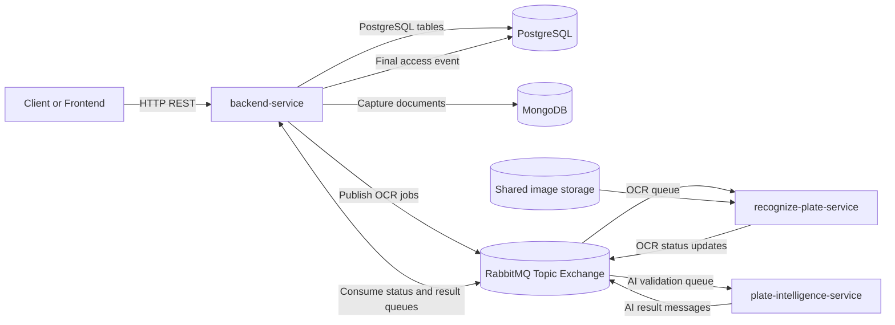
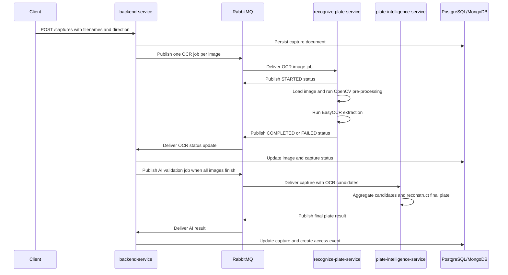
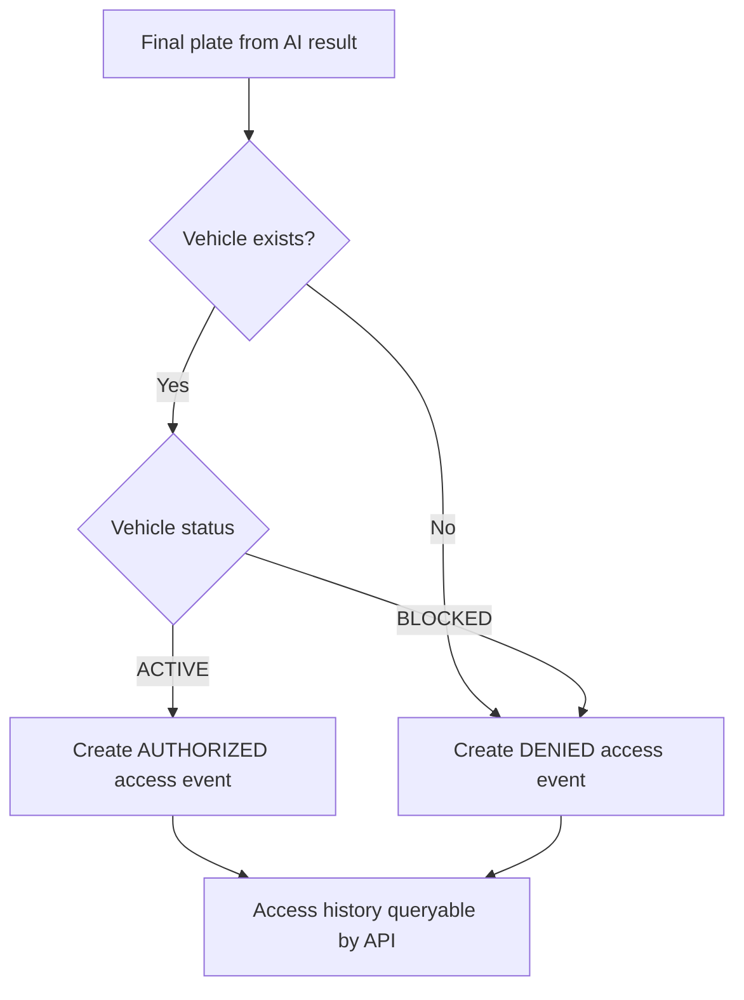
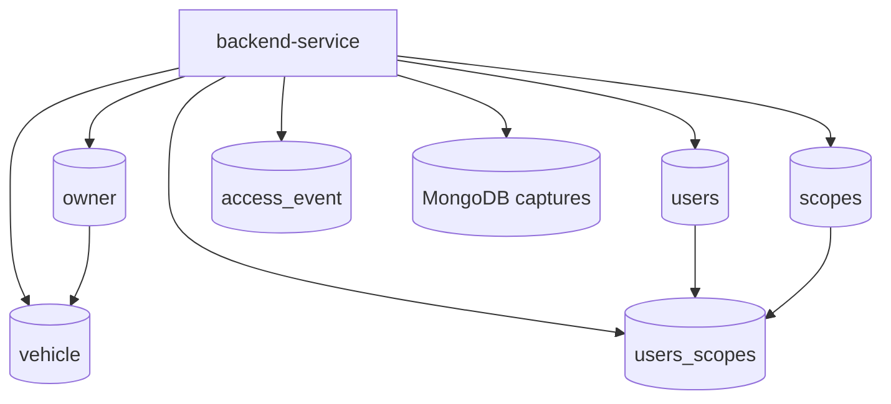
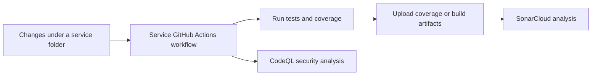

# Access Control System Monorepo

Distributed access-control platform for vehicle entry and exit validation. The monorepo combines a Spring Boot backend, a Python OCR worker, and a Python plate-intelligence worker to process image captures asynchronously and produce auditable access decisions.

The system is designed around service isolation: the backend owns business rules and persistence, the OCR service extracts text from images, and the intelligence service reconstructs the final Brazilian license plate from OCR candidates.

## Services

| Service | Runtime | Responsibility | Documentation |
| --- | --- | --- | --- |
| `backend-service` | Java 17, Spring Boot | REST API, authentication, authorization, owners, vehicles, captures, access events, persistence, RabbitMQ orchestration | [backend-service/README.md](backend-service/README.md) |
| `recognize-plate-service` | Python, OpenCV, EasyOCR | Consumes OCR image jobs, pre-processes images, extracts OCR candidates, publishes image status updates | [recognize-plate-service/README.md](recognize-plate-service/README.md) |
| `plate-intelligence-service` | Python, LangChain, OpenAI | Consumes completed capture analysis jobs, ranks OCR candidates, reconstructs final plate, publishes AI validation results | [plate-intelligence-service/README.md](plate-intelligence-service/README.md) |

## Platform Architecture



## Capture Processing Flow



## Access Decision Flow



## Main Capabilities

- JWT-secured REST API with OAuth2 scopes and method-level authorization.
- Owner, vehicle, user, scope, capture, and access-event management.
- PostgreSQL persistence with Flyway migrations.
- MongoDB capture storage for image-level OCR state and AI result metadata.
- RabbitMQ-based asynchronous orchestration between backend, OCR, and AI services.
- OpenCV-based plate image pre-processing.
- EasyOCR text extraction with bounding boxes and confidence scores.
- LangChain/OpenAI plate reconstruction for Brazilian Mercosul and legacy formats.
- Test coverage and quality gates across Java and Python services.
- GitHub Actions pipelines with coverage, SonarCloud, and CodeQL.

## Repository Layout

```text
.
+-- backend-service
|   +-- src
|   +-- postman
|   +-- pom.xml
|   +-- Dockerfile
|   +-- README.md
+-- recognize-plate-service
|   +-- src
|   +-- test
|   +-- pyproject.toml
|   +-- Dockerfile
|   +-- README.md
+-- plate-intelligence-service
|   +-- src
|   +-- test
|   +-- pyproject.toml
|   +-- Dockerfile
|   +-- README.md
+-- storage
+-- .github
    +-- workflows
```

## Messaging Overview

| Flow | Producer | Consumer | Purpose |
| --- | --- | --- | --- |
| OCR request | `backend-service` | `recognize-plate-service` | Sends one image-processing job per capture image. |
| OCR status update | `recognize-plate-service` | `backend-service` | Reports image status and extracted OCR candidates. |
| AI validation request | `backend-service` | `plate-intelligence-service` | Sends completed capture OCR data for final plate reconstruction. |
| AI validation result | `plate-intelligence-service` | `backend-service` | Returns the final plate, confidence, reasoning, and processing status. |

## Persistence Overview



## CI/CD Overview



| Service | Workflow | Quality Steps |
| --- | --- | --- |
| `backend-service` | `.github/workflows/backend-service-ci-cd.yaml` | Maven `clean verify`, JaCoCo, JAR artifact upload, SonarCloud, CodeQL Java |
| `recognize-plate-service` | `.github/workflows/recognize-plate-service-ci-cd.yaml` | `uv sync`, pytest coverage, SonarCloud, CodeQL Python |
| `plate-intelligence-service` | `.github/workflows/plate-intelligence-service.yml` | `uv sync`, pytest coverage, SonarCloud, CodeQL Python |

## Getting Started

Each service has its own runtime, dependencies, environment variables, and Docker instructions. Start with the service-specific documentation:

1. [backend-service](backend-service/README.md)
2. [recognize-plate-service](recognize-plate-service/README.md)
3. [plate-intelligence-service](plate-intelligence-service/README.md)

Recommended startup order for a full local environment:

1. Start PostgreSQL, MongoDB, RabbitMQ, and shared image storage.
2. Start `backend-service`.
3. Start `recognize-plate-service`.
4. Start `plate-intelligence-service`.
5. Use the backend Swagger UI or Postman collection to create users, owners, vehicles, and captures.

## Documentation Map

- Backend API, data model, scopes, Docker, and Java CI/CD: [backend-service/README.md](backend-service/README.md)
- OCR worker, OpenCV/EasyOCR pipeline, message contract, Docker, and Python CI/CD: [recognize-plate-service/README.md](recognize-plate-service/README.md)
- AI plate reconstruction worker, LangChain/OpenAI prompt flow, message contract, Docker, and Python CI/CD: [plate-intelligence-service/README.md](plate-intelligence-service/README.md)
