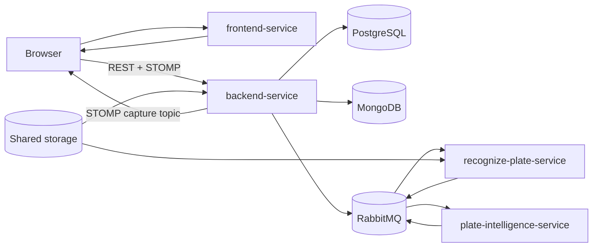
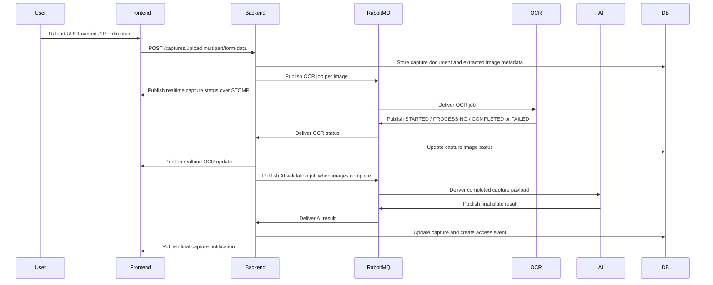
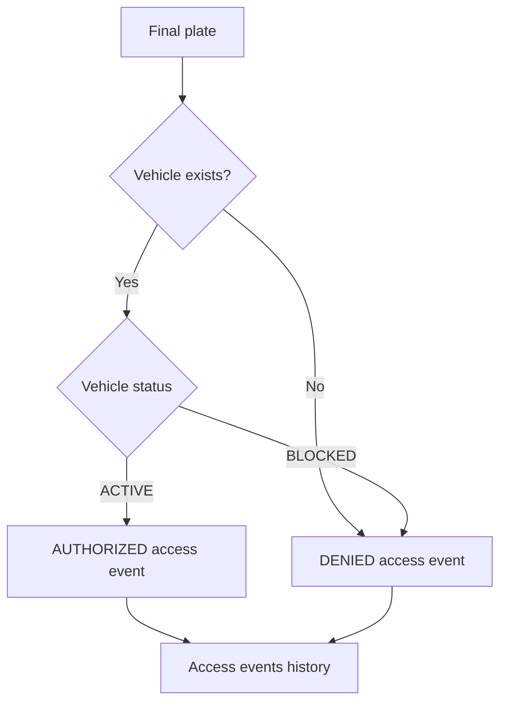

# Access Control System Monorepo

Distributed vehicle access-control platform built as a service-oriented monorepo. The system combines an Angular operations console, a Spring Boot API, a Python OCR worker, and a Python AI worker to process capture ZIP files, extract license-plate candidates, reconstruct a final plate, and create auditable access decisions.

## Services

| Service | Runtime | Main responsibility |
| --- | --- | --- |
| `frontend-service` | Angular 21, TypeScript, Nginx | Browser UI for login, dashboard, captures, vehicles, owners, users, scopes, access events, and realtime capture notifications. |
| `backend-service` | Java 17, Spring Boot 4 | REST API, JWT security, business rules, PostgreSQL/MongoDB persistence, RabbitMQ orchestration, STOMP notifications. |
| `recognize-plate-service` | Python, OpenCV, EasyOCR | RabbitMQ worker that processes capture images and publishes OCR status/results. |
| `plate-intelligence-service` | Python, LangChain, OpenAI | RabbitMQ worker that aggregates OCR candidates and publishes final plate validation results. |

## Platform Architecture



The backend is the system coordinator. It accepts uploads, persists capture state, publishes image-level OCR jobs, consumes worker updates, publishes AI validation jobs, receives final AI results, and creates access events from the final plate.

## Capture Processing Flow



## Access Decision Rule



## Repository Structure

```text
.
+-- backend-service
|   +-- src/main/java/com/arthurscarpin/acs
|   +-- src/main/resources/db/migration
|   +-- postman
|   +-- pom.xml
|   +-- Dockerfile
|   +-- README.md
+-- frontend-service
|   +-- src/app
|   +-- public
|   +-- angular.json
|   +-- package.json
|   +-- Dockerfile
|   +-- nginx.conf
|   +-- README.md
+-- recognize-plate-service
|   +-- src
|   +-- test
|   +-- pyproject.toml
|   +-- uv.lock
|   +-- Dockerfile
|   +-- README.md
+-- plate-intelligence-service
|   +-- src
|   +-- test
|   +-- pyproject.toml
|   +-- uv.lock
|   +-- Dockerfile
|   +-- README.md
+-- storage
+-- docker-compose.yaml
+-- .github/workflows
```

## Messaging

| Flow | Producer | Consumer | Purpose |
| --- | --- | --- | --- |
| OCR request | `backend-service` | `recognize-plate-service` | Sends one image-processing job per extracted capture image. |
| OCR status | `recognize-plate-service` | `backend-service` | Reports image status and OCR candidates. |
| AI validation request | `backend-service` | `plate-intelligence-service` | Sends completed capture OCR data for final plate reconstruction. |
| AI result | `plate-intelligence-service` | `backend-service` | Returns final plate, confidence, reasoning, and processing status. |
| Realtime notification | `backend-service` | `frontend-service` | Sends STOMP updates to `/topic/capture/{captureId}`. |

RabbitMQ topology is declared by the backend. The backend creates the topic exchange, main queues, a dead-letter exchange named `${RABBITMQ_EXCHANGE}.dlx`, and one `.dlq` queue per main queue.

## Persistence

| Storage | Owned by | Data |
| --- | --- | --- |
| PostgreSQL | `backend-service` | owners, vehicles, users, scopes, users-scopes join table, access events |
| MongoDB | `backend-service` | capture documents, capture images, OCR state, AI result metadata |
| Filesystem storage | backend and OCR worker | uploaded ZIP files, backup/error ZIPs, extracted image files |

## Main Capabilities

- JWT authentication with RSA key pair signing.
- Scope-based authorization with `admin:all`, vehicle, owner, access event, and capture scopes.
- Owner, vehicle, user, scope, access-event, and capture management.
- Vehicle status toggle between active and blocked.
- Multipart ZIP upload from the frontend to the backend.
- Asynchronous OCR processing with EasyOCR and OpenCV.
- LLM-assisted final Brazilian plate reconstruction for legacy and Mercosul formats.
- Realtime capture notifications over STOMP WebSocket.
- PostgreSQL migrations with Flyway.
- Automated tests and coverage for backend, frontend, and Python workers.
- GitHub Actions CI/CD with coverage artifacts, SonarCloud, and CodeQL.

## Docker Compose

Start the full platform from the repository root:

```bash
docker compose up --build
```

Services exposed locally:

| Component | URL / Port |
| --- | --- |
| Frontend | `http://localhost:4200` |
| Backend API | `http://localhost:8080` |
| Swagger UI | `http://localhost:8080/swagger/index.html` |
| PostgreSQL | `localhost:5432` |
| MongoDB | `localhost:27017` |
| RabbitMQ AMQP | `localhost:5672` |
| RabbitMQ Management | `http://localhost:15672` |

Recommended startup order when running services manually:

1. PostgreSQL, MongoDB, RabbitMQ, and the shared `storage/` directory.
2. `backend-service`.
3. `recognize-plate-service`.
4. `plate-intelligence-service`.
5. `frontend-service`.

## CI/CD

| Service | Workflow | Main steps |
| --- | --- | --- |
| `backend-service` | `.github/workflows/backend-service-ci-cd.yaml` | Maven verify, JaCoCo, JAR artifact, SonarCloud, CodeQL Java |
| `frontend-service` | `.github/workflows/frontend-service-ci-cd.yaml` | npm ci, Angular/Vitest coverage, production build artifact, SonarCloud, CodeQL JavaScript/TypeScript |
| `recognize-plate-service` | `.github/workflows/recognize-plate-service-ci-cd.yaml` | uv sync, pytest coverage, SonarCloud, CodeQL Python |
| `plate-intelligence-service` | `.github/workflows/plate-intelligence-service.yml` | uv sync, pytest coverage, SonarCloud, CodeQL Python |

Each workflow runs on pull requests to `main` when files inside the corresponding service directory change.

## Service Documentation

- [Frontend Service](frontend-service/README.md)
- [Backend Service](backend-service/README.md)
- [Recognize Plate Service](recognize-plate-service/README.md)
- [Plate Intelligence Service](plate-intelligence-service/README.md)
