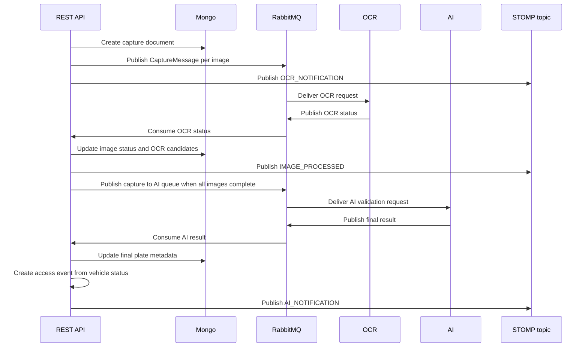

# Backend Service

Spring Boot backend for the Access Control System. This service owns the API, security model, business rules, persistence, messaging topology, capture orchestration, and realtime notifications used by the frontend.

## Responsibilities

- Authenticate users and issue JWT access tokens.
- Authorize requests with OAuth2-style scopes and method-level annotations.
- Manage owners, vehicles, users, scopes, and access events.
- Receive capture ZIP uploads, extract images, and persist capture state.
- Publish OCR jobs to RabbitMQ and consume OCR status updates.
- Publish AI validation jobs and consume final plate results.
- Create access events from the final plate and vehicle status.
- Send capture progress notifications over STOMP WebSocket.

## Architecture

The code follows a domain-first structure:

```text
src/main/java/com/arthurscarpin/acs
+-- core
|   +-- accessevent     # access decision and access history use cases
|   +-- capture         # capture state, ZIP processing orchestration, OCR/AI flow
|   +-- owner           # owner registration and document rules
|   +-- pagination      # shared pagination input/output records
|   +-- scope           # authorization scope lookup
|   +-- user            # user registration and login
|   +-- vehicle         # vehicle registration and status toggle
+-- infrastructure
    +-- configuration   # Spring, security, CORS, OpenAPI, JPA, MongoDB, RabbitMQ, WebSocket
    +-- gateway         # implementations of core gateway contracts
    +-- mapper          # MapStruct mappers
    +-- persistence     # JPA entities, Mongo documents, repositories
    +-- presentation    # REST controllers, requests, responses, AMQP consumers/producers, WebSocket publisher
    +-- util            # shared infrastructure helpers
    +-- zip             # ZIP extraction and storage utilities
```

The `core` package contains business behavior and gateway contracts. The `infrastructure` package adapts those contracts to Spring MVC, Spring Security, JPA, MongoDB, RabbitMQ, STOMP, and filesystem storage.

## Technology Stack

| Area | Technology |
| --- | --- |
| Runtime | Java 17 |
| Framework | Spring Boot 4.0.6 |
| HTTP API | Spring Web MVC |
| Security | Spring Security, OAuth2 Resource Server, JWT, RSA keys, BCrypt |
| Relational database | PostgreSQL |
| Migrations | Flyway |
| Document database | MongoDB |
| Messaging | RabbitMQ, Spring AMQP |
| Realtime | Spring WebSocket/STOMP |
| Mapping | MapStruct |
| API docs | Springdoc OpenAPI / Swagger UI |
| Observability | Spring Boot Actuator, Logback |
| Tests | JUnit, Spring Boot Test, Testcontainers |
| Coverage | JaCoCo with 80% instruction coverage gate |
| Packaging | Maven, Docker |

## API Surface

| Method | Path | Description | Access |
| --- | --- | --- | --- |
| `POST` | `/login` | Authenticates a user and returns JWT token data. | Public |
| `POST` | `/users` | Registers a user with scope ids. | Public in current security config |
| `GET` | `/users` | Lists users with pagination. | `admin:all` |
| `GET` | `/scopes` | Lists configured scopes. | Public |
| `POST` | `/owners` | Registers an owner. | `owner:write` or `admin:all` |
| `GET` | `/owners` | Lists owners with pagination. | `owner:read` or `admin:all` |
| `POST` | `/vehicles` | Registers a vehicle linked to an owner. | `vehicle:write` or `admin:all` |
| `PATCH` | `/vehicles/{id}` | Toggles vehicle status. | `vehicle:write` or `admin:all` |
| `GET` | `/vehicles` | Lists vehicles with owner data and pagination. | `vehicle:read` or `admin:all` |
| `GET` | `/access-events` | Lists access history. Supports `plate`, `from`, `to`, and pagination. | `access_event:read` or `admin:all` |
| `POST` | `/captures/upload` | Uploads a UUID-named ZIP using multipart form data and publishes OCR jobs. | `capture:write` or `admin:all` |
| `GET` | `/actuator/health` | Health check. | Public |
| `GET` | `/api/api-docs` | OpenAPI JSON. | Public |
| `GET` | `/swagger/index.html` | Swagger UI. | Public |
| STOMP | `/ws` | WebSocket endpoint for capture notifications. | Public endpoint, app messages sent by backend |

## Capture Upload Contract

The capture endpoint consumes multipart form data:

| Field | Type | Required | Notes |
| --- | --- | --- | --- |
| `file` | ZIP file | yes | Filename must match a UUID plus `.zip`, for example `550e8400-e29b-41d4-a716-446655440000.zip`. |
| `direction` | `IN` or `OUT` | yes | Access direction stored in the resulting access event. |

Example:

```bash
curl -X POST http://localhost:8080/captures/upload \
  -H "Authorization: Bearer $TOKEN" \
  -F "file=@550e8400-e29b-41d4-a716-446655440000.zip" \
  -F "direction=IN"
```

The backend saves the ZIP to `storage.root`, extracts valid images to `storage.tmp`, moves successfully handled ZIP files to `storage.backup`, and moves failed ZIP files to `storage.error`.

## Capture and Messaging Flow



## RabbitMQ Topology

The backend declares:

- Topic exchange: `${RABBITMQ_EXCHANGE}`
- Dead-letter exchange: `${RABBITMQ_EXCHANGE}.dlx`
- OCR request queue and routing key
- OCR status queue and routing key
- AI validation queue and routing key
- AI result queue and routing key
- One `.dlq` queue for each main queue

Spring AMQP consumers use stateless retry with 3 attempts and exponential backoff from 1000 ms to 10000 ms. After retries are exhausted, the message is rejected without requeue and dead-lettered.

## Persistence Model

```text
PostgreSQL
+-- owner
+-- vehicle
+-- access_event
+-- users
+-- scopes
+-- users_scopes

MongoDB
+-- captures
    +-- images[]
    +-- OCR status and candidates
    +-- final plate, confidence, reasoning
```

Flyway migrations live in `src/main/resources/db/migration`.

## Authorization Scopes

Seeded scopes:

- `admin:all`
- `vehicle:write`
- `vehicle:read`
- `owner:write`
- `owner:read`
- `access_event:write`
- `access_event:read`
- `capture:write`
- `capture:read`

Controller methods use custom annotations such as `@CanWriteVehicle`, `@CanReadOwner`, and `@CanWriteCapture`.

## Configuration

The active profile is controlled by:

```bash
ENVIRONMENT=prod
```

Important variables:

| Variable | Purpose |
| --- | --- |
| `POSTGRES_HOST`, `POSTGRES_PORT`, `POSTGRES_DB`, `POSTGRES_USER`, `POSTGRES_PASSWORD` | PostgreSQL connection. |
| `MONGO_HOST`, `MONGO_PORT`, `MONGO_DB`, `MONGO_USER`, `MONGO_PASSWORD`, `MONGO_AUTHENTICATION` | MongoDB connection. |
| `RABBITMQ_HOST`, `RABBITMQ_PORT`, `RABBITMQ_USERNAME`, `RABBITMQ_PASSWORD`, `RABBITMQ_VIRTUAL_HOST` | RabbitMQ connection. |
| `RABBITMQ_EXCHANGE` | Topic exchange used by the capture pipeline. |
| `RABBITMQ_OCR_ROUTING_KEY`, `RABBITMQ_OCR_QUEUE` | OCR request routing. |
| `RABBITMQ_OCR_STATUS_ROUTING_KEY`, `RABBITMQ_OCR_STATUS_QUEUE` | OCR status routing. |
| `RABBITMQ_AI_VALIDATION_ROUTING_KEY`, `RABBITMQ_AI_VALIDATION_QUEUE` | AI validation request routing. |
| `RABBITMQ_AI_RESULT_ROUTING_KEY`, `RABBITMQ_AI_RESULT_QUEUE` | AI result routing. |
| `STORAGE_PATH` | Base storage path used by Docker Compose. |
| `STORAGE_ROOT`, `STORAGE_BACKUP`, `STORAGE_ERROR`, `STORAGE_TMP` | Optional storage overrides. |

## JWT Keys

The app reads RSA keys from:

```text
classpath:authz.pem
classpath:authz.pub
```

For development, generate keys with:

```bash
openssl genpkey -algorithm RSA -out src/main/resources/authz.pem -pkeyopt rsa_keygen_bits:2048
openssl rsa -pubout -in src/main/resources/authz.pem -out src/main/resources/authz.pub
```

For production, inject secrets through the deployment platform or CI/CD secrets. Do not treat development keys as production credentials.

## Running Locally

Prerequisites:

- Java 17
- Docker or local PostgreSQL, MongoDB, and RabbitMQ
- Maven wrapper support

Run tests and coverage:

```bash
./mvnw clean verify
```

Run the service:

```bash
ENVIRONMENT=prod ./mvnw spring-boot:run
```

Build the JAR:

```bash
./mvnw clean package
```

## Docker

Build:

```bash
docker build -t backend-service .
```

Run with an environment file:

```bash
docker run --rm --env-file ../.env -p 8080:8080 backend-service
```

In the root `docker-compose.yaml`, the service is exposed on `localhost:8080` and mounts repository-root `./storage` into `/app/storage`.

## Tests and Quality

- Unit and integration tests run through Maven.
- Testcontainers are used for PostgreSQL, MongoDB, and RabbitMQ test support.
- JaCoCo runs during `verify` and enforces 80% instruction coverage.
- CI uploads the JAR and JaCoCo report, then runs SonarCloud and CodeQL.

## Useful URLs

| Resource | URL |
| --- | --- |
| API base | `http://localhost:8080` |
| Swagger UI | `http://localhost:8080/swagger/index.html` |
| OpenAPI JSON | `http://localhost:8080/api/api-docs` |
| Health | `http://localhost:8080/actuator/health` |
| STOMP endpoint | `ws://localhost:8080/ws` |
