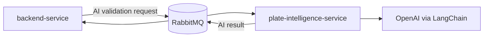

# Plate Intelligence Service

Python AI worker for final license-plate reconstruction. The service consumes completed capture payloads from RabbitMQ, aggregates OCR candidates from all capture images, calls an OpenAI-powered LangChain assistant, and publishes the final plate decision back to RabbitMQ for the backend to persist and convert into an access event.

It does not expose an HTTP API. It is a long-running message consumer.

## Responsibilities

- Consume capture payloads from the AI validation queue.
- Normalize and rank OCR candidates before invoking the LLM.
- Support Brazilian legacy (`ABC1234`) and Mercosul (`ABC1D23`) plate formats.
- Use LangChain/OpenAI for structured final plate reconstruction.
- Publish successful final plate results with confidence and reasoning.
- Publish failure payloads when validation cannot complete.
- Retry unexpected consumer failures with bounded retry headers.
- Let RabbitMQ dead-letter messages after retries are exhausted.

## Role in the Platform



The backend sends a capture to this worker only after OCR processing has completed for its images. The backend remains responsible for applying the access decision rule after receiving the final plate.

## Architecture

```text
src
+-- core
|   +-- gateway         # abstract plate analysis and publishing contract
|   +-- usecase         # validation orchestration
+-- infrastructure
    +-- ai_assistants   # OpenAI/LangChain assistant wrapper and prompt
    +-- configuration   # settings, RabbitMQ, ChatOpenAI, logging
    +-- consumer        # RabbitMQ consumer and retry handling
    +-- gateway         # concrete plate analysis gateway
    +-- parsers         # structured output parser
    +-- plate_analysis  # deterministic OCR candidate aggregation
    +-- producer        # RabbitMQ result publisher
+-- main.py             # dependency wiring and worker startup
test
+-- core
+-- infrastructure
```

The deterministic aggregator runs before the assistant. This keeps the LLM prompt focused on a smaller, ranked set of candidates and makes the reasoning path easier to inspect.

## Processing Flow

```text
RabbitMQ AI validation queue
        |
        v
PlateConsumer
        |
        v
ValidatePlateUseCaseUseCaseImpl
        |
        +-- PlateCandidateAggregator
        |      - normalize OCR text
        |      - detect valid plate formats
        |      - count repetitions
        |      - rank by format, frequency, confidence
        |
        +-- PlateAnlysisGateway
               +-- OpenAIAssistant
               +-- structured output parser
        |
        v
PlateResultProducer
        |
        v
RabbitMQ AI result routing key
```

## Plate Reconstruction Rules

- OCR text is normalized to uppercase alphanumeric candidates.
- Very short candidates are ignored.
- Legacy plates must match `LLLNNNN`.
- Mercosul plates must match `LLLNLNN`.
- Candidate ranking prioritizes valid format, repeated appearances, and confidence.
- The assistant prompt includes common positional OCR corrections such as `0` vs `O`, `1` vs `I`, `5` vs `S`, and `8` vs `B`.
- The assistant response is parsed as structured JSON with final plate, confidence, and reasoning.

## Technology Stack

| Area | Technology |
| --- | --- |
| Runtime | Python 3.12 |
| Dependency management | uv |
| Messaging | RabbitMQ, pika |
| AI orchestration | LangChain |
| LLM provider | OpenAI |
| Data validation | Pydantic, pydantic-settings |
| Configuration | `.env.idea`, `.env`, environment variables |
| Tests | pytest, pytest-cov |
| Packaging | Docker |
| CI/CD | GitHub Actions, SonarCloud, CodeQL |

## Message Contract

### Input

Consumed from `RABBITMQ_AI_VALIDATION_QUEUE`:

```json
{
  "id": "capture-id",
  "images": [
    {
      "id": "image-id",
      "filename": "image-1.jpg",
      "status": "COMPLETED",
      "ocr": [
        {
          "text": "R102A19",
          "confidence": 0.91,
          "bbox": [[10, 20], [120, 20], [120, 60], [10, 60]]
        }
      ]
    }
  ]
}
```

### Successful Output

Published to `RABBITMQ_AI_RESULT_ROUTING_KEY` through `RABBITMQ_EXCHANGE`:

```json
{
  "capture": {
    "id": "capture-id",
    "status": "COMPLETED",
    "finalPlate": "RIO2A19",
    "finalConfidence": 0.94,
    "reasoning": "OCR candidates indicate RIO2A19 after positional correction."
  },
  "error": null
}
```

### Failure Output

```json
{
  "capture": {
    "id": "capture-id",
    "status": "FAILED"
  },
  "error": "error message"
}
```

## Retry Behavior

For unexpected consumer failures:

- the worker reads `x-retry-count` from the message header;
- acknowledges the failed delivery before retry scheduling;
- waits `RABBITMQ_BASE_DELAY_SECONDS ** retry_count` seconds;
- republishes the original body with incremented `x-retry-count`;
- negatively acknowledges without requeue after `RABBITMQ_MAX_RETRIES`.

RabbitMQ dead-letter routing is declared by the backend.

## Configuration

Settings are loaded from `.env.idea` when present, otherwise `.env`, and can also come from environment variables.

| Variable | Purpose |
| --- | --- |
| `ENVIRONMENT` | Runtime environment. Non-production runs may write local NDJSON logs. |
| `RABBITMQ_HOST` | RabbitMQ host. |
| `RABBITMQ_PORT` | RabbitMQ AMQP port. |
| `RABBITMQ_USERNAME` | RabbitMQ username. |
| `RABBITMQ_PASSWORD` | RabbitMQ password. |
| `RABBITMQ_EXCHANGE` | Exchange used to publish AI results. |
| `RABBITMQ_AI_VALIDATION_QUEUE` | Queue consumed by this worker. |
| `RABBITMQ_AI_RESULT_ROUTING_KEY` | Routing key used to publish final results. |
| `RABBITMQ_MAX_RETRIES` | Maximum retry count. |
| `RABBITMQ_BASE_DELAY_SECONDS` | Retry delay base. |
| `OPENAI_API_KEY` | API key used by LangChain/OpenAI. |
| `LANGCHAIN_DEBUG` | Enables LangChain debug logging when true. |
| `LLM_MODEL` | OpenAI chat model used by the assistant. |
| `TEMPERATURE` | Model temperature. Lower values are recommended for deterministic reconstruction. |
| `MAX_TOKENS` | Maximum response tokens. |

Example:

```dotenv
ENVIRONMENT=dev
RABBITMQ_HOST=localhost
RABBITMQ_PORT=5672
RABBITMQ_USERNAME=guest
RABBITMQ_PASSWORD=guest
RABBITMQ_EXCHANGE=access-control.exchange
RABBITMQ_AI_VALIDATION_QUEUE=capture.ai.validation
RABBITMQ_AI_RESULT_ROUTING_KEY=capture.ai.result
RABBITMQ_MAX_RETRIES=3
RABBITMQ_BASE_DELAY_SECONDS=2
OPENAI_API_KEY=sk-...
LANGCHAIN_DEBUG=false
LLM_MODEL=gpt-4o-mini
TEMPERATURE=0
MAX_TOKENS=500
```

## Running Locally

Prerequisites:

- Python 3.12
- uv
- RabbitMQ
- OpenAI API key

Install dependencies:

```bash
uv sync
```

Run the worker:

```bash
uv run python src/main.py
```

Run tests:

```bash
uv run pytest
```

Run tests with explicit coverage output:

```bash
uv run pytest --cov=src --cov-report=xml:coverage.xml --cov-report=term --cov-config=.coveragerc
```

## Docker

Build:

```bash
docker build -t plate-intelligence-service .
```

Run:

```bash
docker run --rm --env-file ../.env plate-intelligence-service
```

The image uses `python:3.12-slim`, copies `uv` from the official Astral image, syncs locked production dependencies, and starts `src/main.py`.

## Docker Compose

The root `docker-compose.yaml` starts this service with:

- dependency on healthy RabbitMQ and backend service;
- RabbitMQ variables from the root `.env`;
- OpenAI and LangChain variables from the root `.env`.

Start it with the full platform:

```bash
docker compose up --build plate-intelligence-service
```

## CI/CD

Workflow:

```text
.github/workflows/plate-intelligence-service.yml
```

Jobs:

- `build-test`: install uv, sync dependencies, run pytest coverage, upload `coverage.xml`.
- `sonar`: download coverage and run SonarCloud.
- `security`: initialize CodeQL for Python, compile sources, analyze.
