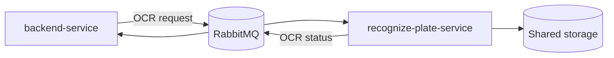

# Recognize Plate Service

Python OCR worker for the Access Control System. This service consumes image-processing jobs from RabbitMQ, resolves image paths from shared storage, pre-processes each image with OpenCV, extracts OCR candidates with EasyOCR, and publishes image-level status updates back to RabbitMQ.

It does not expose an HTTP API. It is a long-running message consumer.

## Responsibilities

- Consume OCR jobs from the configured RabbitMQ queue.
- Publish `STARTED`, `PROCESSING`, `COMPLETED`, and `FAILED` image status events.
- Resolve backend-published filenames against `STORAGE_PATH`.
- Improve OCR quality with OpenCV pre-processing.
- Run EasyOCR and normalize results into JSON-safe payloads.
- Retry unexpected processing failures with bounded retry headers.
- Let RabbitMQ dead-letter messages after retries are exhausted.

## Role in the Platform



The backend publishes one OCR request per extracted capture image. This worker processes each image independently, which allows OCR work to scale horizontally by running multiple worker instances on the same queue.

## Architecture

```text
src
+-- core
|   +-- domain          # capture/image status enums and storage path helpers
|   +-- gateway         # abstract capture processing contract
|   +-- usecase         # OCR orchestration workflow
+-- infrastructure
    +-- configuration   # settings, RabbitMQ factory, logging
    +-- consumer        # RabbitMQ consumer and retry handling
    +-- gateway         # concrete capture publisher gateway
    +-- image_processing # OpenCV pre-processor
    +-- ocr             # EasyOCR processor
    +-- producer        # RabbitMQ OCR status publisher
+-- main.py             # dependency wiring and worker startup
test
+-- unit                # unit tests for domain, use case, adapters, OCR, consumer, producer
```

The use case coordinates the workflow and delegates infrastructure details to gateways and processors.

## Processing Flow

```text
RabbitMQ OCR queue
        |
        v
CaptureConsumer
        |
        v
CaptureUseCaseImpl
        |
        +-- publish STARTED
        +-- resolve image path from STORAGE_PATH
        +-- publish PROCESSING
        +-- OpenCVPreProcessor
        +-- EasyOCRProcessor
        +-- publish COMPLETED with OCR candidates
        +-- publish FAILED if processing cannot complete
```

## Image Processing Pipeline

The OpenCV pre-processor:

- loads the image from disk;
- converts the image to grayscale;
- applies bilateral filtering and Canny edge detection;
- searches contours for a likely license-plate quadrilateral;
- crops the plate region when detected;
- falls back to the full image when no plate candidate is found;
- resizes, denoises, and applies CLAHE before OCR.

The EasyOCR processor returns:

- extracted text;
- confidence score;
- bounding box coordinates converted to integer lists.

## Technology Stack

| Area | Technology |
| --- | --- |
| Runtime | Python 3.11+ and < 3.13 |
| Dependency management | uv |
| Messaging | RabbitMQ, pika |
| OCR | EasyOCR |
| Image processing | OpenCV headless, NumPy |
| ML runtime | torch, torchvision |
| Configuration | pydantic-settings, `.env.idea`, `.env` |
| Tests | pytest, pytest-cov |
| Packaging | Docker |
| CI/CD | GitHub Actions, SonarCloud, CodeQL |

## Message Contract

### Input

Consumed from `RABBITMQ_OCR_QUEUE`:

```json
{
  "captureId": "capture-id",
  "imageId": "image-id",
  "filename": "storage/tmp/capture-id/image-1.jpg",
  "timestamp": "2026-01-01T00:00:00Z"
}
```

`filename` is required. The storage helper accepts relative filenames such as `tmp/capture-id/image-1.jpg` and backend-style paths prefixed with `storage/`.

### Status Output

Published to `RABBITMQ_OCR_STATUS_ROUTING_KEY` through `RABBITMQ_EXCHANGE`.

Started:

```json
{
  "captureId": "capture-id",
  "imageId": "image-id",
  "filename": "image-1.jpg",
  "image_status": "STARTED",
  "capture_status": "PROCESSING",
  "message": "Execution started",
  "ocr": []
}
```

Completed:

```json
{
  "captureId": "capture-id",
  "imageId": "image-id",
  "filename": "image-1.jpg",
  "image_status": "COMPLETED",
  "capture_status": "PROCESSING",
  "message": "Execution completed",
  "ocr": [
    {
      "text": "ABC1D23",
      "confidence": 0.91,
      "bbox": [[10, 20], [120, 20], [120, 60], [10, 60]]
    }
  ]
}
```

Failed:

```json
{
  "captureId": "capture-id",
  "imageId": "image-id",
  "image_status": "FAILED",
  "capture_status": "PROCESSING",
  "message": "Filename is not found",
  "ocr": []
}
```

## Retry Behavior

For unexpected consumer failures:

- the worker reads `x-retry-count` from the message header;
- acknowledges the failed delivery before retry scheduling;
- waits `RABBITMQ_BASE_DELAY_SECONDS ** retry_count` seconds;
- republishes the original body with incremented `x-retry-count`;
- negatively acknowledges without requeue after `RABBITMQ_MAX_RETRIES`.

RabbitMQ dead-letter routing is declared by the backend.

## Configuration

Settings are loaded from `.env.idea` when present, otherwise `.env`, and can also come from environment variables.

| Variable | Purpose |
| --- | --- |
| `ENVIRONMENT` | Runtime environment. Non-production runs may write local NDJSON logs. |
| `RABBITMQ_HOST` | RabbitMQ host. |
| `RABBITMQ_PORT` | RabbitMQ AMQP port. |
| `RABBITMQ_USERNAME` | RabbitMQ username. |
| `RABBITMQ_PASSWORD` | RabbitMQ password. |
| `RABBITMQ_EXCHANGE` | Exchange used to publish OCR statuses. |
| `RABBITMQ_OCR_QUEUE` | Queue consumed by this worker. |
| `RABBITMQ_OCR_STATUS_ROUTING_KEY` | Routing key for OCR status events. |
| `RABBITMQ_AI_VALIDATION_ROUTING_KEY` | Required by the current settings model for platform consistency. |
| `RABBITMQ_MAX_RETRIES` | Maximum retry count. |
| `RABBITMQ_BASE_DELAY_SECONDS` | Retry delay base. |
| `STORAGE_PATH` | Root path used to resolve image filenames. |

Example:

```dotenv
ENVIRONMENT=dev
RABBITMQ_HOST=localhost
RABBITMQ_PORT=5672
RABBITMQ_USERNAME=guest
RABBITMQ_PASSWORD=guest
RABBITMQ_EXCHANGE=access-control.exchange
RABBITMQ_OCR_QUEUE=capture.ocr.processing
RABBITMQ_OCR_STATUS_ROUTING_KEY=capture.ocr.updated
RABBITMQ_AI_VALIDATION_ROUTING_KEY=capture.ai.validation
RABBITMQ_MAX_RETRIES=3
RABBITMQ_BASE_DELAY_SECONDS=2
STORAGE_PATH=../storage
```

## Running Locally

Prerequisites:

- Python 3.11 or 3.12
- uv
- RabbitMQ
- Shared storage directory containing extracted capture images

Install dependencies:

```bash
uv sync
```

Run the worker:

```bash
uv run python src/main.py
```

Run tests:

```bash
uv run pytest
```

Run tests with explicit coverage output:

```bash
uv run pytest --cov=src --cov-report=xml:coverage.xml --cov-report=term --cov-config=.coveragerc
```

## Docker

Build:

```bash
docker build -t recognize-plate-service .
```

Run:

```bash
docker run --rm --env-file ../.env -v "$PWD/../storage:/app/storage" recognize-plate-service
```

The image uses `python:3.11-slim`, installs OS libraries required by OpenCV, installs `uv`, syncs locked dependencies, and starts `src/main.py`.

## Docker Compose

The root `docker-compose.yaml` starts this service with:

- dependency on healthy RabbitMQ and backend service;
- shared `./storage:/app/storage` volume;
- RabbitMQ and storage variables from the root `.env`.

Start it with the full platform:

```bash
docker compose up --build recognize-plate-service
```

## CI/CD

Workflow:

```text
.github/workflows/recognize-plate-service-ci-cd.yaml
```

Jobs:

- `build-test`: install uv, sync dependencies, run pytest coverage, upload `coverage.xml`.
- `sonar`: download coverage and run SonarCloud.
- `security`: initialize CodeQL for Python, compile sources, analyze.
